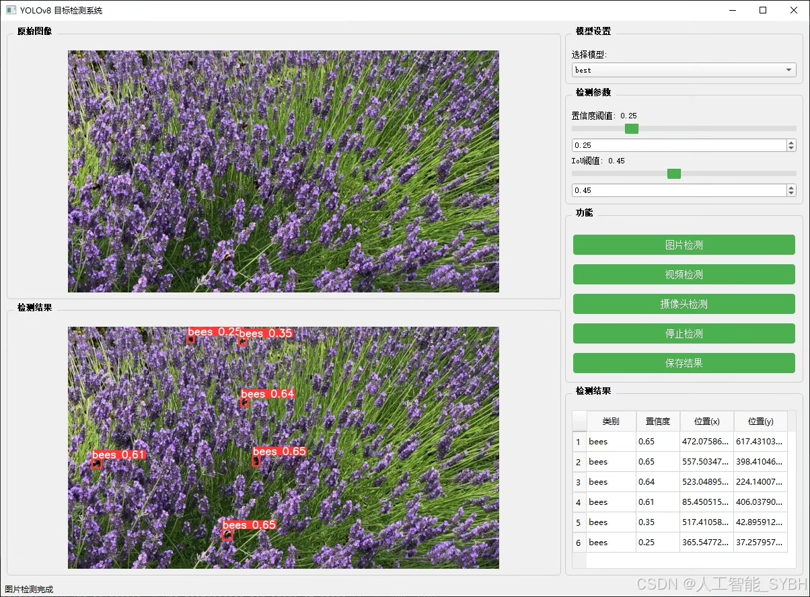
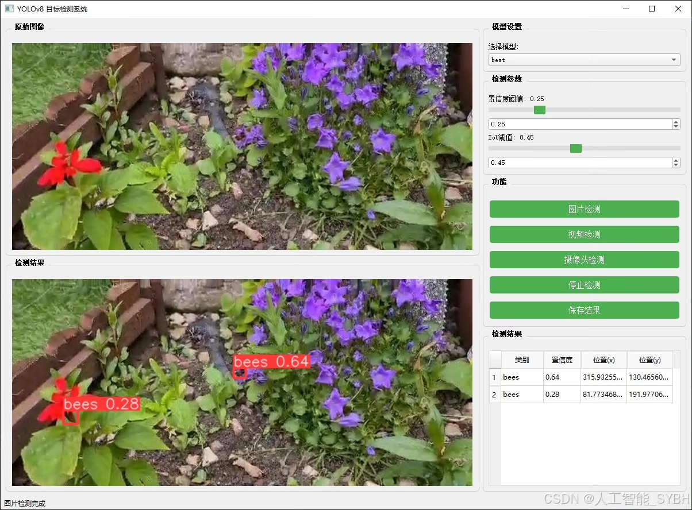
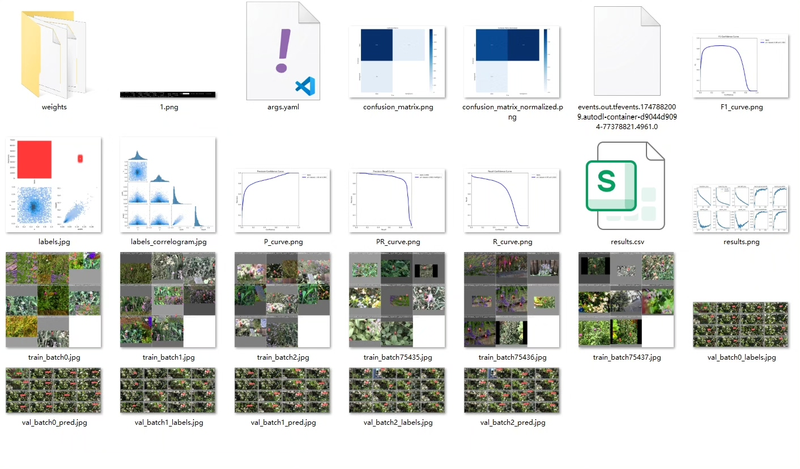
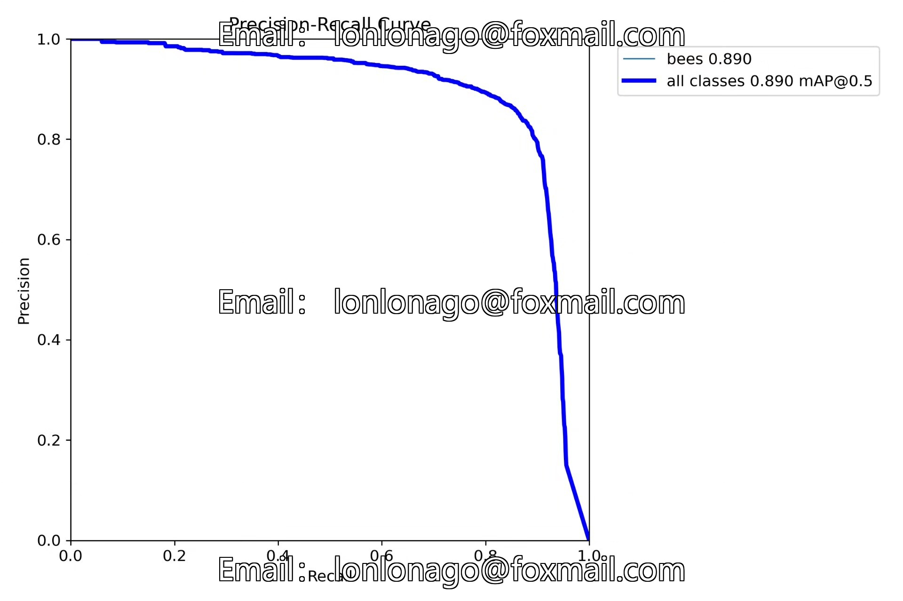
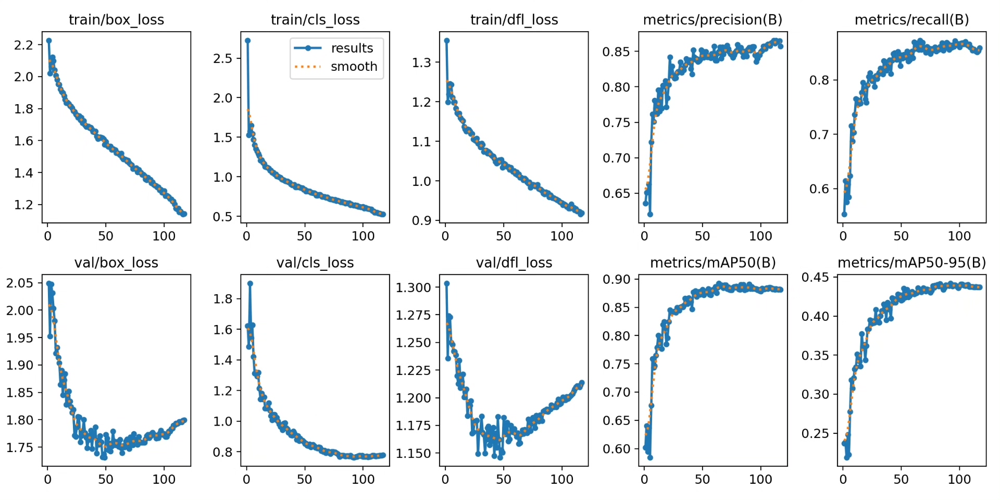
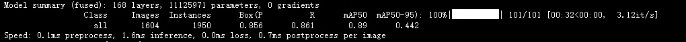
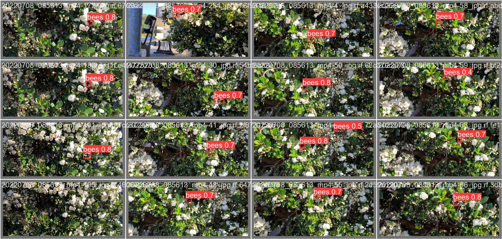
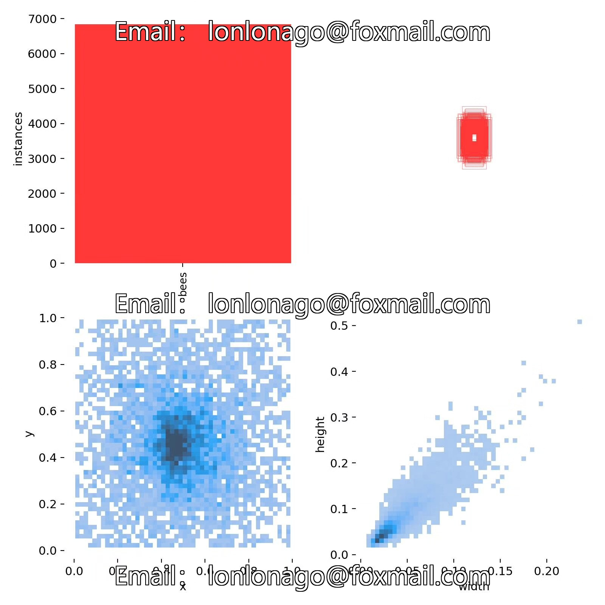

# Based on deep learning YOLOv8 for bee recognition detection system (YOLOv8+Y)

## Body

This project is based on the YOLOv8 deep learning framework, developing a high-precision bee recognition and detection system. It is specifically designed for monitoring bee colonies, ecological research, and agricultural pollination management. The system targets "bees" as the detection target, achieving precise recognition and localization of individual bees through computer vision technology. It can effectively count the number of bee colonies, analyze activity trajectories, and monitor abnormal behaviors. The dataset includes 5640 training images, 1604 validation images, and 836 test images, covering different lighting conditions, background environments, and bee flight postures to ensure the model's strong generalization capability.

The company's products have obtained the official commercial license certification from YOLO.

We provide after-sales service:

After payment, we will provide WeChat IDs for instant questions and answers.

Environmental configuration: We will provide an instruction tutorial for environmental configuration, with WeChat providing Q&A services.

Remote installation service: If you need remote configuration, an additional fee of 69 is required, with all fees refunded if the configuration fails (only the installation fee is refunded for older computers).

Retraining dataset: After setting up the environment, you can train on your own computer. If you need us to retrain, just pay 69 plus the computing power fee (2.5 yuan/hour).

Full after-sales service

## Images

## Payment

Here is a pay link on Stripe ( https://buy.stripe.com/3cs8yP7sY87d0vu9AB ). Please contact me lonlonago@foxmail.com after funding $89, and I will send you a complete data files , thank you!

